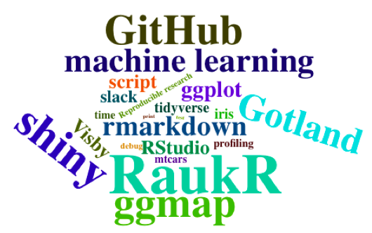

# Aim of the project

- To create a shiny application that visualize statistics for Airbnb data

# Dataset

Detailed listings data for Stockholm

http://insideairbnb.com/


---

# Functionalities
- A map of regions (price, rating score etc. )

- Word cloud (description, amenities etc. )

```{r, out.width = "300px", echo=FALSE}

```

- Histograph price per room types

- Boxplots with statistical test for regions


