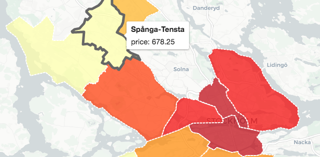
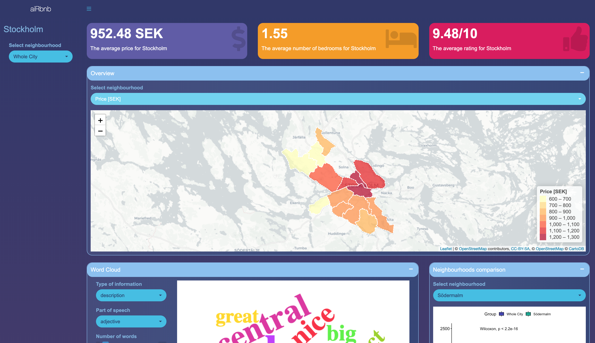

# Aim of the project

- To create a shiny application that visualize statistics for Airbnb data

# Dataset

Detailed listings data for Stockholm

http://insideairbnb.com/


---

# Application features


- Map of neighbourhoods (price, rating score etc.)
- Word cloud (description, amenities etc.)
- Histogram of price per room types
- Pie chart of superhost fraction
- Boxplots with statistical test of price in 2 neighbourhoods

.pull-left[
```{r, out.width = "350px", echo=FALSE}

```
]
.pull-right[
```{r, out.width = "350px", echo=FALSE}
knitr::include_graphics("sample_wordcloud.png")
```
]

---

# Sample code

removing outliers:
```{r eval=FALSE}
remove_outs <- function(x, q_min="10%", q_max="90%") {

  if(!is.character(q_min) | !is.character(q_max)) {
    w <- simpleWarning("Quantile thresholds should be character. Qmin and Qmax set to default")
    w %>% print
    q_min <- "10%"
    q_max <- "90%"
  }

  qnts <- quantile(x, probs=seq(0,1,by=.05))
  cut_1 <- qnts %>% enframe %>% filter(name==q_min) %>% .$value
  cut_2 <- qnts %>% enframe %>% filter(name==q_max) %>% .$value

  x <- x %>% enframe %>% filter(value > cut_1 & value < cut_2) %>% .$value

}
```

---

# Benchmarking
```{r eval=FALSE}
library(rbenchmark)
```

```{r echo=FALSE, warning=FALSE}
library(knitr)
library(kableExtra)
names2 <- c("elapsed","relative","user.self","sys.self")
after <- c(36.213, 1.000, 33.249, 1.050)
before <- c(454.004, 12.537, 430.026, 7.932)

df<-as.data.frame(rbind(after, before))
colnames(df) <- names2
kable(df, format='html', caption="Word cloud function performance")
```
</br>
</br>
</br>
```{r echo=FALSE, warning=FALSE}
library(knitr)
library(kableExtra)
names3 <- c("elapsed","relative","user.self","sys.self")
generate_map <- c(0.046, 5.1, 0.043, 0.002)
remove_outs <- c(0.009, 1.0, 0.004, 0.002)
wilcox_test <- c(0.073, 8.1, 0.072, 0.001)
df2<-as.data.frame(rbind(generate_map, remove_outs, wilcox_test))
colnames(df2) <- names3
kable(df2, format='html', caption="Other functions performance")
```

---
# aiRbnb app

```{r echo=FALSE}

```
https://github.com/mategarb/aiRbnb

---
# Session Information

94 packages:

assertthat, backports, broom, cellranger, class, classInt, cli, colorspace, crayon, crosstalk, curl, dashboardthemes, data.table, DBI, digest, dplyr, e1071, evaluate, forcats, foreign, generics, geojson, geojsonio, geojsonR, ggplot2, ggpubr, ggsignif, glue, gtable, haven, hms, htmltools, htmlwidgets, httpuv, httr, jqr, jsonlite, KernSmooth, knitr, labeling, later, lattice, lazyeval, leaflet, lubridate, magrittr, maptools, Matrix, mime, modelr, munsell, nlme, pander, pillar, pkgconfig, plyr, promises, purrr, R6, rbenchmark, RColorBrewer, Rcpp, readr, readxl, rgdal, rgeos, rlang, rmarkdown, rstudioapi, rvest, scales, sessioninfo, sf, shiny, shinydashboard, shinyWidgets, sp, stringi, stringr, tibble, tidyr, tidyselect, tidyverse, udpipe, units, V8, withr, wordcloud, wordcloud2, xaringan, xfun, xml2, xtable, yaml
---
background-image: url(background.jpg)
fontsize: 50pt
.center[
</br>
</br>
</br>
</br>
</br>
</br>
</br>
<font size="20">
<span style="color:white">
Thank you
</span>
</font>

]


